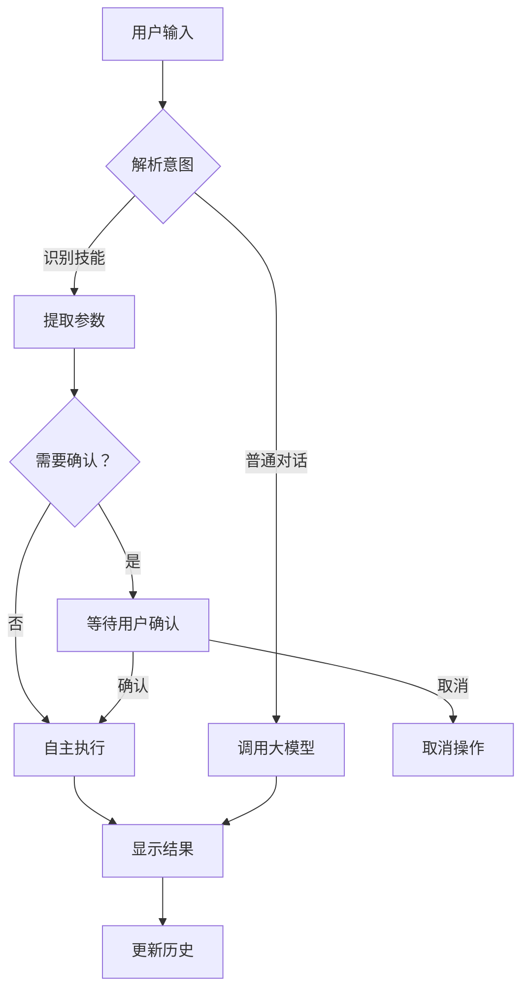

# 终端对话助手使用指南

## 🎉 概述

终端对话助手（Terminal Agent）是一个类似 Claude Code 的命令行交互工具，让大模型能在终端中直接识别并执行工作流中的技能操作，实现自主高效的任務完成！

---

## ✨ 核心特性

### 1. **自然语言交互**
```bash
❯ 学习 https://dev.epicgames.com/.../cpp-basics
❯ 用 C++ 写一个游戏模式
❯ 创建一个 Python 工具项目
```

### 2. **智能技能识别**
- ✅ 自动识别用户意图
- ✅ 匹配对应技能
- ✅ 提取参数
- ✅ 自主执行

### 3. **自主执行模式**
- ✅ 大部分操作自主执行
- ✅ 修改/删除操作需确认
- ✅ 安全可靠

### 4. **实时反馈**
- ✅ 执行进度显示
- ✅ 结果即时反馈
- ✅ 错误清晰提示

---

## 🚀 快速开始

### 1. 启动终端助手

```bash
# 基本启动
node terminal-agent.js

# 指定 API 服务器
node terminal-agent.js --api http://localhost:3003

# 关闭自主模式（所有操作都需确认）
node terminal-agent.js --no-auto

# 查看帮助
node terminal-agent.js --help
```

### 2. 开始对话

```bash
╔════════════════════════════════════════╗
║  终端对话助手 v1.0                      ║
║  类似 Claude Code 的交互体验            ║
╚════════════════════════════════════════╝

✅ 已加载 7 个技能
✅ 自主模式：开启

输入 help 查看帮助，输入 exit 退出

❯ 
```

---

## 📚 可用技能

### 1. learn_webpage - 学习网页

**用途**: 学习网页内容并提取代码示例

**示例**:
```bash
❯ 学习 https://dev.epicgames.com/documentation/unreal-engine/programming-with-cplusplus-in-unreal-engine

📚 正在学习：https://dev.epicgames.com/...
✅ 学习完成，提取了 5 个代码示例
```

**参数**:
- `url` ⭐必填：网页 URL

---

### 2. batch_learn_webpages - 批量学习

**用途**: 批量学习多个网页

**示例**:
```bash
❯ 批量学习 https://url1.com https://url2.com https://url3.com

📚 正在批量学习 3 个网页...
✅ 学习完成，成功：3/3
```

**参数**:
- `urls` ⭐必填：URL 列表（最多 20 个）
- `options` ⚙️可选：学习选项

---

### 3. safe_write_file - 写入文件

**用途**: 安全写入文件

**示例**:
```bash
❯ 保存代码到 main.cpp

⚠️  确认操作
技能：safe_write_file
参数：{"path": "main.cpp", "content": "..."}
是否继续？(y/n): y

📝 正在写入文件：main.cpp
✅ 文件已保存：main.cpp
```

**参数**:
- `path` ⭐必填：文件路径
- `content` ⭐必填：文件内容

---

### 4. safe_read_file - 读取文件

**用途**: 安全读取文件

**示例**:
```bash
❯ 读取 main.cpp

📖 正在读取文件：main.cpp
✅ 文件读取成功，共 150 行
```

**参数**:
- `path` ⭐必填：文件路径

---

### 5. safe_list_directory - 浏览目录

**用途**: 浏览目录内容

**示例**:
```bash
❯ 查看 src 目录

📁 正在浏览目录：src
✅ 目录内容：8 个文件/文件夹
```

**参数**:
- `path` ⭐必填：目录路径

---

### 6. generate_code - 生成代码

**用途**: 生成代码

**示例**:
```bash
❯ 用 C++ 写一个猜数字游戏

🤖 正在生成代码：用 C++ 写一个猜数字游戏
✅ 代码生成完成，质量评分：100/100
```

**参数**:
- `requirement` ⭐必填：需求描述
- `language` ⚙️可选：编程语言
- `framework` ⚙️可选：框架

---

### 7. create_project - 创建项目

**用途**: 创建完整项目

**示例**:
```bash
❯ 创建一个 Python 工具项目

🚀 正在创建项目：MyProject
📊 项目分析:
   类型：python_tool
   模块数：3
   文件数：6

✅ 项目创建完成：generated/MyProject
```

**参数**:
- `projectName` ⭐必填：项目名称
- `requirement` ⭐必填：项目需求

---

## 💡 使用示例

### 示例 1：学习并保存教程

```bash
❯ 学习 https://dev.epicgames.com/.../cpp-basics

📚 正在学习：https://dev.epicgames.com/...
✅ 学习完成，提取了 5 个代码示例

❯ 保存到 cpp-tutorial.md

⚠️  确认操作
技能：safe_write_file
参数：{"path": "cpp-tutorial.md", "content": "..."}
是否继续？(y/n): y

📝 正在写入文件：cpp-tutorial.md
✅ 文件已保存：cpp-tutorial.md
```

---

### 示例 2：批量学习多个教程

```bash
❯ 批量学习这些 C++ 教程：
   https://url1.com
   https://url2.com
   https://url3.com

📚 正在批量学习 3 个网页...
✅ 学习完成，成功：3/3

❯ 生成学习报告

🤖 正在生成代码：生成学习报告
✅ 代码生成完成，质量评分：95/100
```

---

### 示例 3：创建完整项目

```bash
❯ 创建一个虚幻五 RPG 游戏项目

🚀 正在创建项目：UE5_RPG_Game
📊 项目分析:
   类型：unreal_game
   模块数：4
   文件数：10

✅ 项目创建完成：generated/UE5_RPG_Game
```

---

### 示例 4：生成并保存代码

```bash
❯ 用 C++ 写一个吃金币游戏模式

🤖 正在生成代码：用 C++ 写一个吃金币游戏模式
✅ 代码生成完成，质量评分：110/100

❯ 保存到 CoinGameGameMode.cpp

⚠️  确认操作
技能：safe_write_file
参数：{"path": "CoinGameGameMode.cpp", "content": "..."}
是否继续？(y/n): y

📝 正在写入文件：CoinGameGameMode.cpp
✅ 文件已保存：CoinGameGameMode.cpp
```

---

## 🎯 控制命令

| 命令 | 功能 |
|------|------|
| `help` | 显示帮助信息 |
| `clear` | 清空屏幕 |
| `history` | 显示对话历史 |
| `exit` / `quit` | 退出程序 |

---

## ⚙️ 配置选项

### 命令行参数

```bash
node terminal-agent.js [选项]
```

| 参数 | 说明 | 默认值 |
|------|------|--------|
| `--api <url>` | API 服务器地址 | `http://localhost:3003` |
| `--model <name>` | 使用的模型 | `qwen2.5-coder` |
| `--no-auto` | 关闭自主模式 | - |
| `--help`, `-h` | 显示帮助 | - |

### 自主模式

**开启自主模式（默认）**：
- ✅ 学习、读取、生成等操作自主执行
- ⚠️ 写入、删除、执行命令需确认

**关闭自主模式**：
```bash
node terminal-agent.js --no-auto
```
- ⚠️ 所有操作都需确认

---

## 🔧 技能识别规则

终端助手会自动识别以下模式：

### 1. 学习网页
```bash
学习 <URL>
学习这个网页：<URL>
帮我学习：<URL>
```

### 2. 批量学习
```bash
批量学习 <URL1> <URL2> ...
学习多个网页：<URL1>, <URL2>
```

### 3. 生成代码
```bash
用 <语言> 写一个 <功能>
生成 <语言> 代码：<需求>
创建一个 <功能> 程序
```

### 4. 创建项目
```bash
创建一个 <语言> 项目
开发一个 <类型> 项目
```

### 5. 文件操作
```bash
保存到 <文件路径>
读取 <文件路径>
查看 <目录路径>
```

---

## 📊 执行流程



---

## 🎓 最佳实践

### 1. 清晰描述需求

```bash
# ✅ 好的描述
用 C++ 写一个虚幻五游戏模式，包括吃金币、血量、倒计时系统

# ❌ 模糊的描述
写个游戏
```

### 2. 提供具体参数

```bash
# ✅ 具体参数
学习 https://dev.epicgames.com/.../cpp-basics 并保存到 cpp-basics.md

# ❌ 缺少参数
学习这个
```

### 3. 分步执行复杂任务

```bash
# 第一步：学习
❯ 学习 https://example.com/tutorial

# 第二步：生成代码
❯ 根据教程生成代码

# 第三步：保存
❯ 保存到 output.cpp
```

### 4. 使用批量学习

```bash
# ✅ 批量学习相关教程
❯ 批量学习 https://url1.com https://url2.com https://url3.com

# 然后生成综合报告
❯ 生成学习报告
```

---

## ⚠️ 注意事项

### 1. 文件操作安全

- ✅ 读取文件：自主执行
- ⚠️ 写入文件：需要确认
- ⚠️ 删除文件：需要确认

### 2. URL 有效性

确保提供的 URL 是有效的：
```bash
# ✅ 完整 URL
https://dev.epicgames.com/documentation/...

# ❌ 不完整
dev.epicgames.com/...
```

### 3. 批量学习限制

- 最少：1 个 URL
- 最多：20 个 URL
- 建议：5-10 个 URL 一批

### 4. 代码生成质量

- ✅ 需求越具体，质量越高
- ✅ 提供框架信息更好
- ⚠️ 复杂需求可能需多轮对话

---

## 🎉 总结

### 核心优势

- ✅ **自然语言交互** - 像和人对话一样
- ✅ **智能技能识别** - 自动理解意图
- ✅ **自主高效执行** - 大部分操作自主完成
- ✅ **安全可靠** - 危险操作需确认
- ✅ **实时反馈** - 进度和结果即时显示

### 使用场景

- ✅ 快速学习教程
- ✅ 生成代码片段
- ✅ 创建完整项目
- ✅ 文件批量处理
- ✅ 自动化工作流

### 未来扩展

- [ ] 支持更多技能
- [ ] 工作流编排
- [ ] 插件系统
- [ ] 自定义技能
- [ ] 语音交互

---

**开始使用**：
```bash
node terminal-agent.js
```

**体验类似 Claude Code 的终端交互！** 🚀✨

---

*版本*: v1.0  
*创建时间*: 2026-04-17  
*技能数量*: 7 个  
*自主模式*: ✅ 支持
